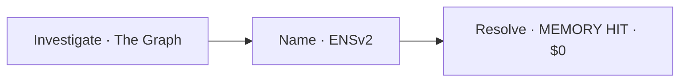
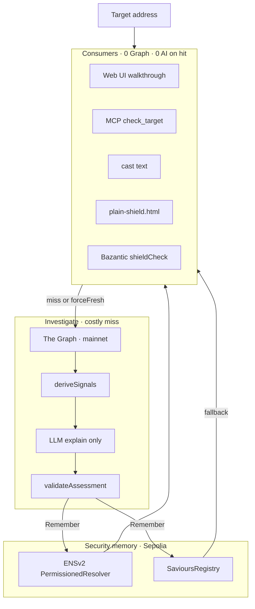
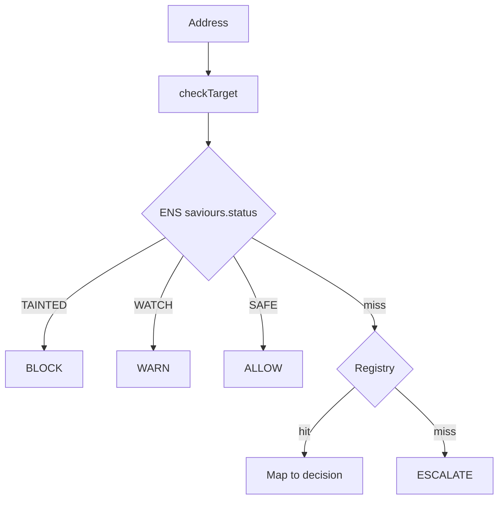
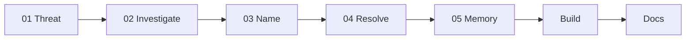

# SAVIOURS

**Public security memory for AI agents and wallets.**

Investigate an address once with The Graph. Name the verdict on ENS forever.
Every agent after you resolves it for **$0**.

| | |
|---|---|
| **App** | [www.saviours.xyz](https://www.saviours.xyz) |
| **Build / integrate** | [www.saviours.xyz/#build](https://www.saviours.xyz/#build) · [`docs/INTEGRATE.md`](docs/INTEGRATE.md) |
| **npm** | [`@saviours/check`](https://www.npmjs.com/package/@saviours/check) |
| **Gateway** | [saviours.bazgateway.com/mcp](https://saviours.bazgateway.com/mcp) (POST) · human guide [/gateway](https://www.saviours.xyz/gateway) |
| **GitHub** | [github.com/devhb1/Saviour](https://github.com/devhb1/Saviour) |
| **Support** | [b4harshit01@gmail.com](mailto:b4harshit01@gmail.com) · [@harshitb01](https://twitter.com/harshitb01) · [devhb1](https://github.com/devhb1) |
| **Tracks** | ENS Best Use of ENSv2 · Graph Composable/Standardized · Bazantic Agentify |
| **Deadline** | Sun 13 Sep 2026 · 12:00 EDT |



Deep dive: [`docs/ARCHITECTURE.md`](docs/ARCHITECTURE.md) · all diagrams for Excalidraw: [`docs/DIAGRAMS.md`](docs/DIAGRAMS.md)

---

## Why this exists

Autonomous agents will hit the same drainers thousands of times — each paying Graph + AI to rediscover a fact someone already proved. Detection fires alerts. Nobody **names** the finding so the next agent can look it up like a CVE.

SAVIOURS is that naming layer: prove once on The Graph → publish on ENSv2 → every consumer after resolves for free.

---

## Product law

1. Only **WATCH** / **TAINTED** are named. SAFE is never a name.
2. SAFE / no-name ≠ endorsement. **UNKNOWN** is deliberate.
3. Evidence = Ethereum **mainnet** Graph. Memory = **Sepolia** ENSv2.
4. AI explains and cites. `validateAssessment` decides. AI never writes ENS.
5. Shield / MEMORY HIT is **$0 forever** (UI, MCP, gateway).
6. Canonical name only: `<lowercase-address>.saviours.eth`.
7. Provenance seeds are never counted as Graph detections.

---

## How it works

| Step | What runs |
|---|---|
| **01 Investigate** | 1 Messari template × 8 pinned deployments + Adapter A → deterministic signals → LLM explains (cites only) → validator decides |
| **02 Name** | `<address>.saviours.eth` on Sepolia · `saviours.*` text records · EAC role caps · WATCH 7d / TAINTED 10y |
| **03 Resolve** | ENS-first Shield · MCP · `cast` · [`@saviours/check`](https://www.npmjs.com/package/@saviours/check) — **0 Graph · 0 AI · $0** on MEMORY HIT |

**Who pays:** the calling agent, via Bazantic x402 (USDC on Base) on a miss — **not this website**. The second agent pays nothing *because* the first one paid.

### Quick start for integrators

```bash
# Wallet / app
pnpm add @saviours/check

# Agent
claude mcp add --transport http saviours https://saviours.bazgateway.com/mcp
```

Full paths, troubleshooting, and support contacts: [`docs/INTEGRATE.md`](docs/INTEGRATE.md) · in-app **Build → Help**.

### Live heroes

| ID | Address | Verdict | Rule path |
|---|---|---|---|
| ATTACK-1 | `0x935bfb495e33f74d2e9735df1da66ace442ede48` | **TAINTED** | `FLASHLOAN_ONE_SHOT` ∧ `ATOMIC_MULTI_PROTOCOL` |
| BOT-1 | `0x352423…3cc7` | **WATCH** | `BOT_PROFILE` (negative control — refuse to overfit) |

---

## Architecture (overview)

Full trust boundary, sequences, and module map: [`docs/ARCHITECTURE.md`](docs/ARCHITECTURE.md).



### Trust who decides what

| Layer | May decide | Must not |
|---|---|---|
| The Graph (live mainnet) | Evidence rows | Invent threats |
| `deriveSignals` | Signal ids | Write chain |
| LLM | Explanation + cite ids | Own status / write ENS |
| `validateAssessment` | Final status | Accept model TAINTED without threat-class signal |
| ENSv2 texts | Portable verdict | Replace Graph truth |
| Shield Tier-1 | BLOCK / WARN / ALLOW / ESCALATE | Call Graph or AI |

### Chain split

| Concern | Network |
|---|---|
| Threat evidence | Ethereum **mainnet** |
| Security memory | **Sepolia** ENSv2 + SavioursRegistry |

### Resolve path (MEMORY HIT)



---

## User / demo walkthrough

Nav **is** the film. Hashes: `#threat` `#investigate` `#name` `#resolve` `#memory` `#build` `#docs` (`#case` = depth only).



| Beat | What you see |
|---|---|
| **01 Threat** | Tagline · mechanism · 3 track cards · Receipts · What isn't built |
| **02 Investigate** | ATTACK-1 fan-out · Agent Client Console (ENS → 402 → settle) · second agent `$0` · Fleet Run 5 |
| **03 Name** | Ceremony FOUND→NAME→RECORDS→TX→PASSPORT · cast · EAC wrong-role revert |
| **04 Resolve** | Paste address → BLOCK · 0 Graph · 0 AI · $0 |
| **05 Memory** | Graph-verified vs seeded buckets (never laundered) |
| **Build / Docs** | `@saviours/check` · recipe · OpenAPI |

Film script: [`docs/DEMO_CUE.md`](docs/DEMO_CUE.md).
---

## Surfaces & integrations

| Surface | Role |
|---|---|
| Web UI | Numbered walkthrough · agent client · naming ceremony · Fleet Run |
| `@saviours/check` | ENS / shield / full modes for integrators |
| MCP | `check_target` · `investigate_target` · `fanout_target` · … |
| Bazantic gateway | MCP **17 tools** · Free / ~$0.01 / ~$0.05 · 5 published recipes |
| `cast` / `plain-shield.html` | Independent resolve — no Next server |

Bazantic meters; it does **not** replace Graph or ENS. Details: [`docs/BAZANTIC.md`](docs/BAZANTIC.md).

---

## Quick start

```bash
pnpm install && cp .env.example .env
# Required for Shield/ENS:  SEPOLIA_RPC_URL
# Investigate:              GRAPH_API_KEY + AI_API_KEY
# Remember (writes):        RELAYER_PRIVATE_KEY (+ INVESTIGATOR_ / DISPUTER_)

pnpm dev    # http://localhost:3000
pnpm mcp    # stdio MCP server
```

Production writes are **fail-closed** unless both `SAVIOURS_ALLOW_WRITES=1` and `NEXT_PUBLIC_SAVIOURS_ALLOW_WRITES=1`.

---

## Prove it without our server

```bash
cast call 0xF479306621F718F7d76875f67506ceD33717751c \
  "text(bytes32,string)(string)" \
  $(cast namehash 0x935bfb495e33f74d2e9735df1da66ace442ede48.saviours.eth) \
  saviours.status \
  --rpc-url $SEPOLIA_RPC_URL
# → TAINTED
```

Or open [`consumers/plain-shield.html`](consumers/plain-shield.html) / run [`consumers/live-agent`](consumers/live-agent).

---

## Repo layout

| Path | Role |
|---|---|
| `apps/web` | Next.js UI + APIs |
| `packages/core` | Graph · signals · investigate · ENS · Shield |
| `packages/check` | Client SDK |
| `packages/mcp` | MCP server |
| `contracts` | SavioursRegistry (Foundry) |
| `consumers/` | live-agent · plain-shield |
| `evals/` · `deployments/` | Locked targets · on-chain records |
| `docs/` | Architecture · diagrams · partners · submission |

```mermaid
flowchart TB
  web[apps/web] --> core[packages/core]
  mcp[packages/mcp] --> core
  check[packages/check] --> ens[ENSv2 Sepolia]
  core --> graph[The Graph mainnet]
  core --> ens
  core --> reg[SavioursRegistry]
  web --> baz[Bazantic gateway]
  consumers[consumers/plain-shield] --> ens
```

---

## Docs

| Doc | Purpose |
|---|---|
| [ARCHITECTURE.md](docs/ARCHITECTURE.md) | Full trust · control · data · modules · diagrams |
| [DIAGRAMS.md](docs/DIAGRAMS.md) | All Mermaid in one file — paste into Excalidraw |
| [diagrams/](docs/diagrams/) | Individual `.mmd` sources (one file per board) |
| [ENS.md](docs/ENS.md) | ENSv2 identity · EAC · addresses |
| [GRAPH_QUERIES.md](docs/GRAPH_QUERIES.md) | Messari fan-out · Adapter A |
| [BAZANTIC.md](docs/BAZANTIC.md) | Gateway · pricing · e2e |
| [DEMO_CUE.md](docs/DEMO_CUE.md) | ~3 min film script |
| [SUBMISSION.md](docs/SUBMISSION.md) | ETHGlobal form copy · partners |
| [DIFFERENTIATION.md](docs/DIFFERENTIATION.md) | vs Mandate / Immunity / NpmGuard |
| [THREAT_MODEL.md](docs/THREAT_MODEL.md) | Trust assumptions |
| [AI-USAGE.md](docs/AI-USAGE.md) | ETHGlobal AI disclosure |
| [BAZANTIC.md](docs/BAZANTIC.md) | Gateway · pricing tiers · e2e |
| [recipes/PUBLISH_KIT.md](docs/recipes/PUBLISH_KIT.md) | 5 published recipes · paste kit |
| [recipes/safe-swap-with-memory.md](docs/recipes/safe-swap-with-memory.md) | Multi-service prize recipe |
| [recipes/saviours-check-before-sign.md](docs/recipes/saviours-check-before-sign.md) | Core check-before-sign |

---

## Gates (pre-film)

```bash
pnpm typecheck
pnpm check:shield && pnpm check:ens-resolve && pnpm check:ens-story
pnpm check:clean-pin && pnpm check:mcp && pnpm check:incidents
pnpm bazantic:e2e   # optional: local grant for paid settle
```

---

## Identity (Sepolia)

| Item | Value |
|---|---|
| Parent | `saviours.eth` |
| PermissionedResolver | `0xF479306621F718F7d76875f67506ceD33717751c` |
| UserRegistry | `0x3BA6b1c9F0018cac383C17C2ACA5A4dC0F370De5` |
| SavioursRegistry | `0x8f246dd1f7bdd6d169b3cdb77e95d4e84eaff5db` |

Source of truth: `deployments/*.json` — do not invent addresses.

---

## What we claim / do not claim

**Claim:** live Graph proof for flashloan ∧ atomic multi-protocol on ATTACK-1 · BOT-1 WATCH contrast · ENSv2 hierarchical memory + EAC permission model · MEMORY HIT = 0 Graph · 0 AI · $0.

**Do not claim:** broad detector · eight custom Graph integrations (it is **1 template × 8 deployments**) · decentralized dispute · mainnet ENS enforcement of Sepolia memory.
