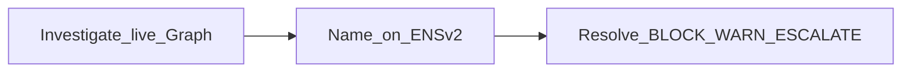

# SAVIOURS

**Investigate once. Remember forever.**

Security memory for AI agents — turn a verified onchain threat into a named,
portable ENSv2 identity that any agent can resolve with **0 Graph · 0 AI**.

| | |
|---|---|
| **GitHub** | [github.com/devhb1/Saviour](https://github.com/devhb1/Saviour) |
| **Showcase** | [ethglobal.com/showcase/saviour-9j673](https://ethglobal.com/showcase/saviour-9j673) |
| **ETHOnline 2026** | Graph Composable/Standardized · Graph AI · ENS Best Use of ENSv2 |



---

## What we shipped (end product)

The full loop is **live** — not a mock:

| Capability | Status |
|---|---|
| **Investigate** | Live Messari fan-out (1 template × 8 deployments) + Adapter A → deterministic signals → AI explains with citations → validator owns the verdict |
| **Name** | Address-label ENSv2 on Sepolia (`<address>.saviours.eth`) + story texts + SavioursRegistry + optional IPFS dossier |
| **Resolve** | ENS-first Shield · MCP · `cast` · zero-SDK `plain-shield.html` — **0 Graph · 0 AI** on MEMORY HIT |
| **Govern** | Graph-verified vs provenance honesty · EAC permission model (live investigator dispute revert) · dispute / revoke |
| **UI** | Investigate · Resolve · Govern — forceFresh default ON · Standards registry · rule-paths strip · HeroAtomic · Sepolia ceiling · write fail-closed in production |

### Hero proof (live mainnet Graph → Sepolia memory)

| Target | Verdict | Proof |
|---|---|---|
| ATTACK-1 `0x935bfb…ede48` | **TAINTED** | `FLASHLOAN_ONE_SHOT` ∧ `ATOMIC_MULTI_PROTOCOL` (same tx `hash` across protocols) |
| BOT-1 `0x352423…3cc7` | **WATCH** | Same fan-out · `BOT_PROFILE` — not TAINTED |

Other Govern rows are **provenance-seeded** (postmortems) and labeled — not sold as pipeline discoveries.

**Honest Graph claim:** one Messari-standardized template × eight pinned subgraph ids (+ Adapter A) — **not** eight custom integrations. Empty protocol = honest empty, not failure.

---

## Why it exists

Agents rediscover the same drainers over and over. Alerts fire; nobody **names**
the finding so the next agent can look it up like a CVE.

SAVIOURS is that naming layer: investigate once on The Graph, remember on ENSv2,
resolve forever for free.

Detection is intentionally **narrow** (one proven attack pattern + related rule
paths). **Naming + resolve** is the product.

---

## How the loop works

| Step | What runs |
|---|---|
| **Investigate** | Shield pre-check → (miss / forceFresh) live Graph fan-out → signals → LLM explains (cites only) → `validateAssessment` decides. TAINTED needs a threat-class signal. |
| **Name** | ENS texts: status, threat, evidenceHash, dossier, investigator, dispute + `plainVerdict` / `atomicTx` / … · registry append · WATCH 7d / TAINTED 10y · non-transferable · EAC role caps |
| **Resolve** | Read `saviours.status` first → BLOCK / WARN / ALLOW / ESCALATE · no Graph · no AI |

**Chain split (shown in UI):** evidence = Ethereum **mainnet**; memory = **Sepolia** ENSv2 beta.

**Verified rule paths:** ONE_SHOT∧ATOMIC → TAINTED · BOT_PROFILE → WATCH · REGISTRY_COOCCURRENCE → TAINTED on a live Graph edge (propagation).

---

## Surfaces

| Surface | What you get |
|---|---|
| **Web** `pnpm dev` | Investigate · Resolve · Govern |
| **MCP** `pnpm mcp` | `check_target` · `investigate_target` · `get_incident` · `list_standard_protocols` · `fanout_target` |
| **plain-shield.html** | BLOCK without Next (public Sepolia RPC) |
| **cast** | Read ENS texts on the live resolver |

---

## Quick start

```bash
pnpm install && cp .env.example .env
# Shield / ENS:     SEPOLIA_RPC_URL
# Investigate:      GRAPH_API_KEY + AI_API_KEY (or OPEN_AI_API_KEY)
# Remember:         RELAYER_PRIVATE_KEY (+ INVESTIGATOR_/DISPUTER_)
# Public host:      ALLOW_WRITES unset/=0 and NEXT_PUBLIC_SAVIOURS_ALLOW_WRITES unset/=0
# Writable staging: both ALLOW_WRITES=1
# Local pnpm dev:   unset is open

pnpm dev    # http://localhost:3000
pnpm mcp    # Cursor / Claude stdio
```

---

## Prove resolve without our app

```bash
cast call 0xF479306621F718F7d76875f67506ceD33717751c \
  "text(bytes32,string)(string)" \
  $(cast namehash 0x935bfb495e33f74d2e9735df1da66ace442ede48.saviours.eth) \
  saviours.status \
  --rpc-url $SEPOLIA_RPC_URL
# → "TAINTED"
```

Or open [`consumers/plain-shield.html`](consumers/plain-shield.html).

---

## Before you film / demo

Live-only checklist: **[docs/USER_FLOW_AND_DEMO.md](docs/USER_FLOW_AND_DEMO.md) §3**  
Cue sheet (resolve-first ~3:30): **[docs/DEMO_CUE.md](docs/DEMO_CUE.md)**  
Partners / portal: **[docs/SUBMISSION.md](docs/SUBMISSION.md)** · AI: **[docs/AI-USAGE.md](docs/AI-USAGE.md)**

```bash
pnpm check:force-fresh && pnpm check:ens-story && pnpm check:clean-pin \
  && pnpm check:shield && pnpm check:cooccur && pnpm check:mcp
```

---

## Judge Q&A

| Question | Answer |
|---|---|
| Eight integrations? | One template × eight Messari deployments. Adapter A is a second Graph product. |
| How big is the detected registry? | Two Graph-verified demo rows. Other Govern rows are provenance-seeded. |
| Decentralized dispute? | No — EAC **permission model** on our operator wallets; live revert. |
| Mainnet forever? | Evidence mainnet; memory Sepolia — ceiling is on the product UI. |

---

## Identity (Sepolia)

| Item | Value |
|---|---|
| Parent | `saviours.eth` |
| Resolver | `0xF479306621F718F7d76875f67506ceD33717751c` |
| UserRegistry | `0x3BA6b1c9F0018cac383C17C2ACA5A4dC0F370De5` |
| SavioursRegistry | `0x8f246dd1f7bdd6d169b3cdb77e95d4e84eaff5db` |

Do not invent addresses — see `deployments/*.json` and [docs/ENS.md](docs/ENS.md).

---

## Repo layout

| Path | Role |
|---|---|
| `apps/web` | Next.js UI + APIs |
| `packages/core` | Graph · signals · investigate · ENS · Shield |
| `packages/mcp` | MCP server (5 tools) |
| `contracts` | SavioursRegistry (Foundry) |
| `consumers/` | Zero-SDK plain-shield |
| `evals/` · `deployments/` | Locked targets · on-chain records |

---

## Docs

| Doc | Use |
|---|---|
| [ARCHITECTURE.md](docs/ARCHITECTURE.md) | Control/data flow diagrams |
| [USER_FLOW_AND_DEMO.md](docs/USER_FLOW_AND_DEMO.md) | Manual live tests · hosting |
| [DEMO_CUE.md](docs/DEMO_CUE.md) | Resolve-first ~3:30 film script |
| [JUDGE_AUDIT.md](docs/JUDGE_AUDIT.md) | Harsh scores |
| [DIFFERENTIATION.md](docs/DIFFERENTIATION.md) | Coverage · vs monitors |
| [PIVOT.md](docs/PIVOT.md) | Product law |
| [GRAPH_QUERIES.md](docs/GRAPH_QUERIES.md) · [ENS.md](docs/ENS.md) | Track detail |
| [AI-USAGE.md](docs/AI-USAGE.md) | ETHOnline AI attribution |
| [SUBMISSION.md](docs/SUBMISSION.md) | ETHGlobal form · partners Graph+ENS only |

---

## Hosting

Next `apps/web` primary. Production writes are **fail-closed** unless both
`SAVIOURS_ALLOW_WRITES=1` and `NEXT_PUBLIC_SAVIOURS_ALLOW_WRITES=1`. ENS/registry
already on Sepolia. MCP stays local stdio. Details: USER_FLOW §5.
