# Architecture

Trust boundary, control flow, data flow, module map, and UI walkthrough for SAVIOURS.

**Companions:** [DIAGRAMS.md](./DIAGRAMS.md) (Excalidraw-ready Mermaid) · [GRAPH_QUERIES.md](./GRAPH_QUERIES.md) · [BAZANTIC.md](./BAZANTIC.md) · [INTEGRATE.md](./INTEGRATE.md) · [THREAT_MODEL.md](./THREAT_MODEL.md)

**Product law:** root [README.md](../README.md).  
**UI walkthrough:** 01 Threat · 02 Investigate · 03 Name · 04 Resolve · 05 Memory · Build · Docs (`#case` = depth only).

---

## 0. Big picture

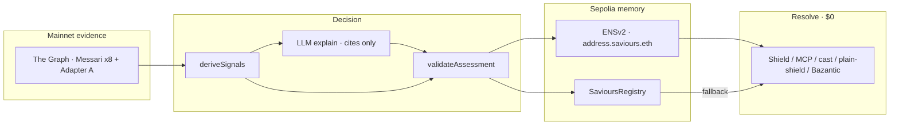

**Loop:** Investigate once → Name forever → Resolve for free. Detection is narrow; **naming** is the product.

---

## 1. System context

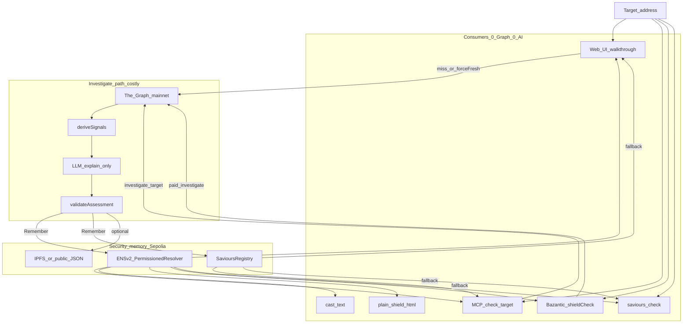

---

## 2. Trust boundary (who may decide what)

| Layer | May decide | Must not |
|---|---|---|
| The Graph (live mainnet) | Evidence rows only | Invent threats; offline dumps in product paths |
| `deriveSignals` | Signal ids from evidence | Write chain state |
| LLM | Natural-language explanation + cite ids | Own status; write ENS/registry |
| `validateAssessment` | Final `status` / confidence | Accept model TAINTED without threat-class signal |
| ENSv2 texts | Portable verdict for any resolver client | Replace Graph truth |
| SavioursRegistry | Append-only ledger + Shield fallback | Shorten TAINTED history on dispute |
| Shield Tier-1 | BLOCK / WARN / ALLOW / ESCALATE | Call Graph or AI |
| Bazantic | Meter miss / pass through | Own memory or verdict |

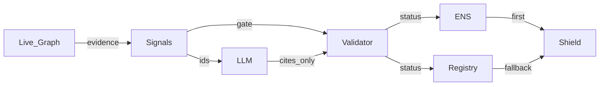

---

## 3. Chain boundary

| Concern | Network | Why |
|---|---|---|
| Threat evidence | Ethereum **mainnet** `chainId=1` | Real Messari + Adapter A activity |
| Security memory | **Sepolia** ENSv2 + SavioursRegistry | ENSv2 beta; intentional ceiling |
| Agent settle | **Base** USDC (x402 via Bazantic) | Gateway invoices `network: base` |
| Local proof | Anvil | `check:hero-loop` backup |

`Incident.chainId` = **target** chain (usually 1), not the memory deployment chain.

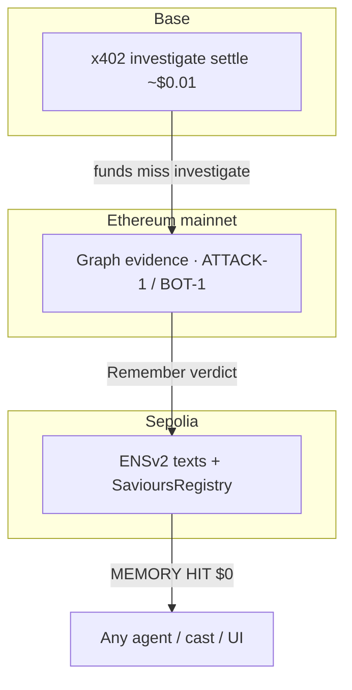

---

## 4. User walkthrough (UI = product film)

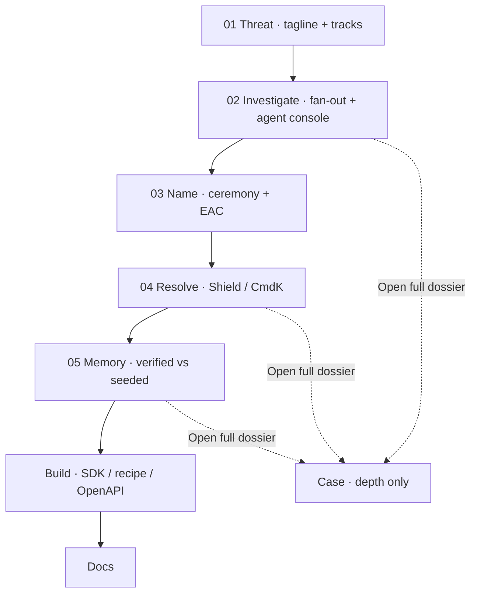

| Hash | Screen | Job |
|---|---|---|
| `#threat` | Home | Frame the product + honesty |
| `#investigate` | Investigate | Live Graph + who pays |
| `#name` | Identity / ceremony | ENS is the API |
| `#resolve` | Resolve / ⌘K | MEMORY HIT decision |
| `#memory` | Memory | Provenance buckets |
| `#build` / `#docs` | Build / Docs | Outside this UI |
| `#case` | Case | Depth — not a primary beat |

---

## 5. Control flow — Investigate → Remember

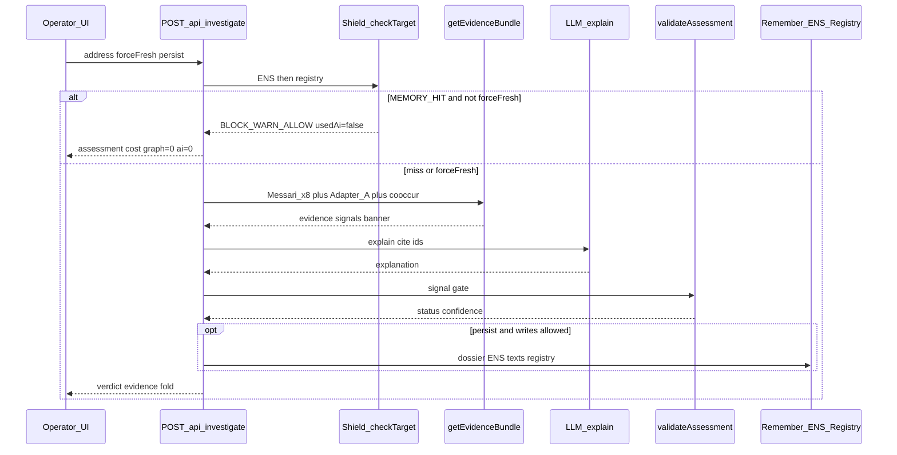

### Branch table

| Condition | Graph | AI | Persist |
|---|---|---|---|
| MEMORY HIT · `forceFresh=false` | 0 | 0 | no |
| MEMORY HIT · `forceFresh=true` | live | explain | if writes on |
| Miss | live | explain | if writes on + WATCH/TAINTED |
| Writes fail-closed (prod unset/`=0`) | live OK | live OK | never |

---

## 6. Control flow — Agent pay (Bazantic)

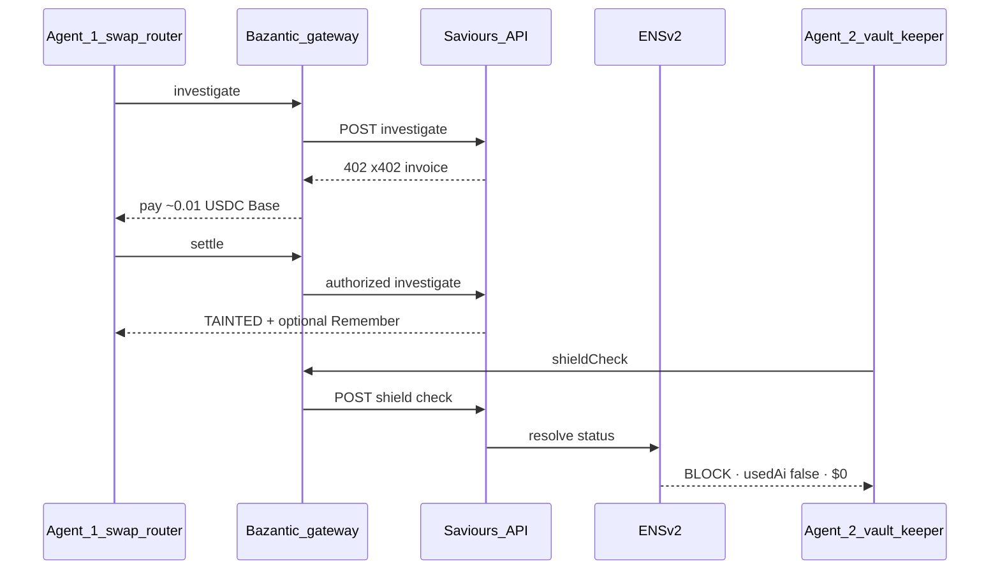

Pitch: Graph + ENS first. Bazantic = settlement at the miss — never the hero detector.

---

## 7. Control flow — Resolve (0 Graph · 0 AI)

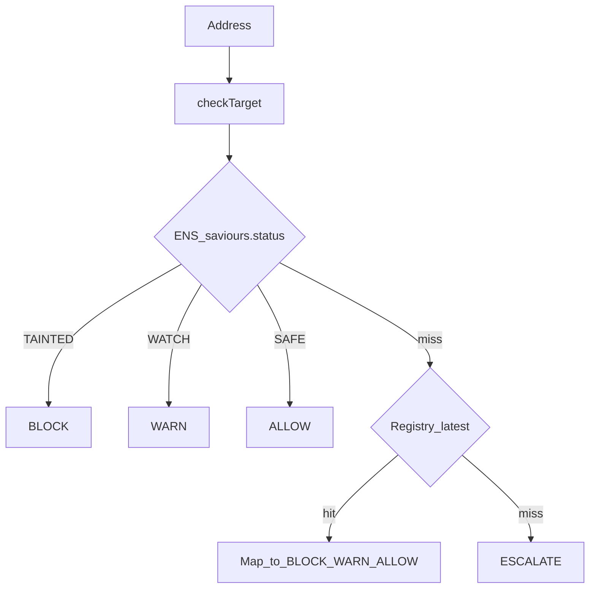

Consumers: UI Resolve · MCP `check_target` · `cast` · `plain-shield.html` · Bazantic `shieldCheck` — **none** call The Graph or the LLM on MEMORY HIT.

---

## 8. Control flow — Name (ceremony + EAC)

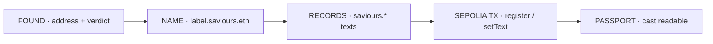

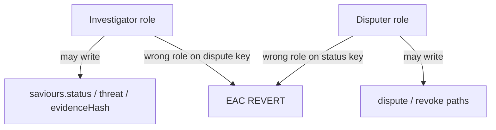

EAC proves **permission model in code** (operator wallets today) — not decentralization.

---

## 9. Control flow — Govern / Memory honesty

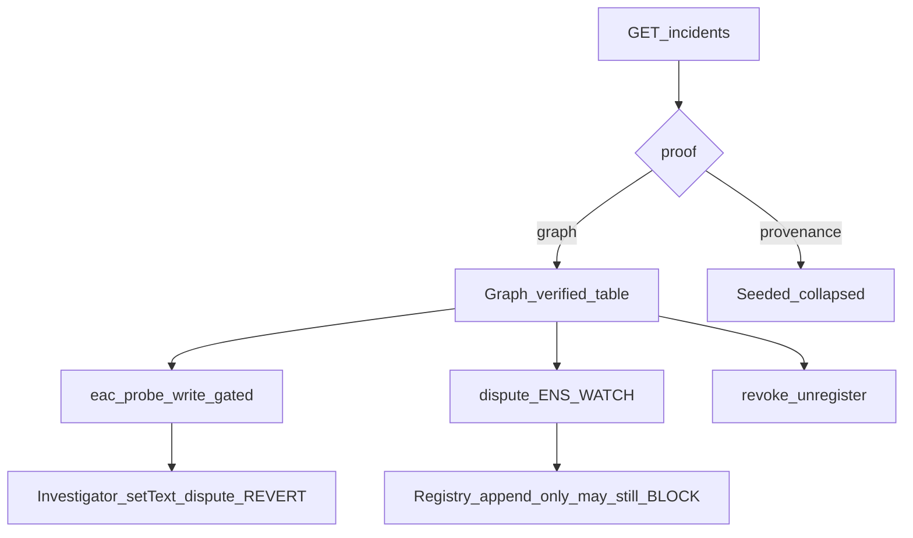

Buckets never laundered: seeds are not Graph detections.

---

## 10. Evidence pipeline (Graph)

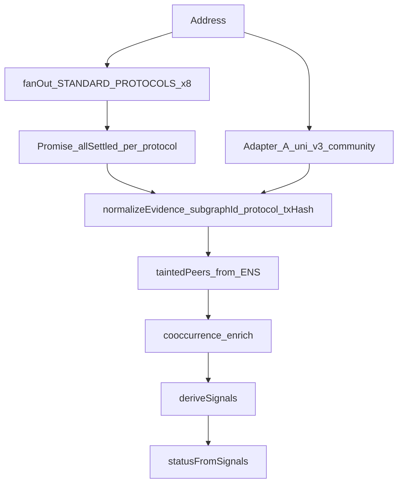

**ATOMIC_MULTI_PROTOCOL** = set intersection on shared Messari `hash` across protocols.  
**Excluded** (never queried): Balancer / Pancake / Convex — broken on network (Coverage honesty).

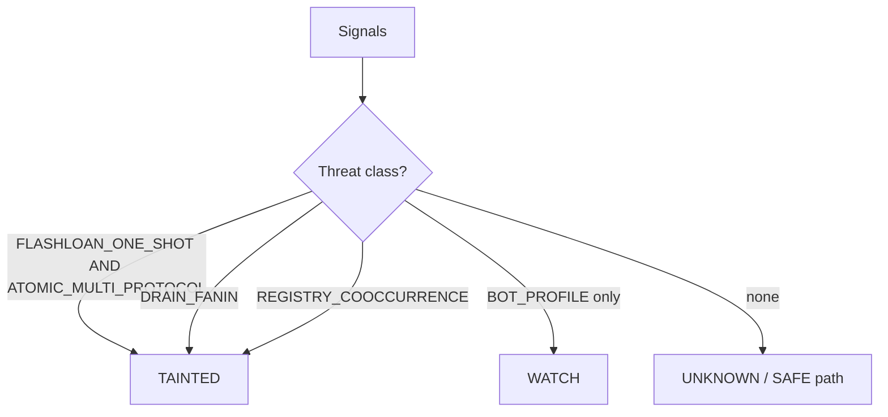

Signal gate (TAINTED): `(FLASHLOAN_ONE_SHOT ∧ ATOMIC_MULTI_PROTOCOL) ∨ DRAIN_FANIN ∨ REGISTRY_COOCCURRENCE`  
`BOT_PROFILE` caps at WATCH.

---

## 11. Module map (`packages/core`)

```mermaid
flowchart TB
  inv[investigator] --> ev[evidence]
  inv --> sh[shield]
  inv --> ens[ens]
  inv --> reg[registry]
  inv --> llm[llm]
  inv --> dos[dossier]
  ev --> graph[graph]
  ev --> sig[signals]
  sh --> ens
  sh --> reg
  mcp[packages/mcp] --> inv
  web[apps/web APIs] --> inv
```

| Dir | Responsibility | Key entry |
|---|---|---|
| `graph/` | Gateway, `fanOut`, protocols table, Adapter A/B | `fanOut`, `STANDARD_PROTOCOLS` |
| `evidence/` | Normalize, cache, signals, co-occurrence, bundle | `getEvidenceBundle` |
| `investigator/` | Shield pre-check, explain, cost/trace, remember wire | `investigateDetailed` |
| `classifier/` | Validator / signal gate | `validateAssessment` |
| `ens/` | Labels, resolve, register, roles, dispute, EAC | `resolveIncident`, `registerIncidentName` |
| `registry/` | SavioursRegistry client | `rememberValidatedAssessment` |
| `shield/` | ENS-first Tier-1 | `checkTarget` |
| `dossier/` | Pinata / public JSON (soft-skip) | `pinAssessmentDossier` |
| `incidents/` | Seed ∪ live index | `listAllIncidents` |
| `memory/` | Live TAINTED peers | `loadDemoAttackSeeds` |
| `llm/` | OpenAI client | `chatCompletion` |

---

## 12. Surfaces & APIs

| Surface | Entry |
|---|---|
| Web UI | `apps/web` — 01 Threat → 05 Memory · Build · Docs · `#case` depth |
| HTTP | `/api/investigate` · `/api/evidence/[chainId]/[address]` · `/api/shield/check` · `/api/resolve` · `/api/incidents` · `/api/govern/*` · `/api/agent/stream` · `/api/dossier/fetch` · `/api/fingerprint/recompute` |
| MCP | `check_target` · `investigate_target` · `get_incident` · `list_standard_protocols` · `fanout_target` |
| Zero-SDK | `consumers/plain-shield.html` |
| Contracts | `contracts/src/SavioursRegistry.sol` |

### Write gate

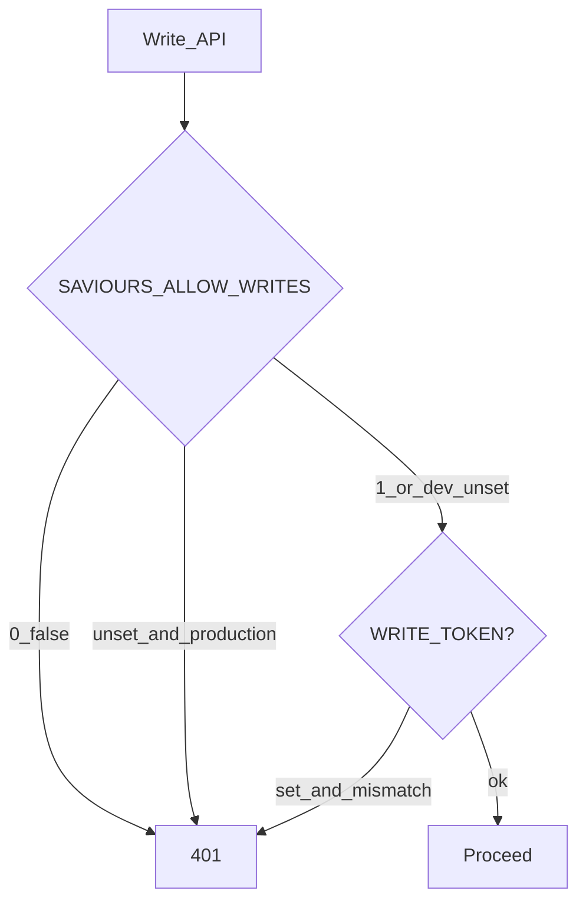

Browser: `NEXT_PUBLIC_SAVIOURS_ALLOW_WRITES` mirrors for `persist` (Investigate).

---

## 13. State machines

### Assessment status

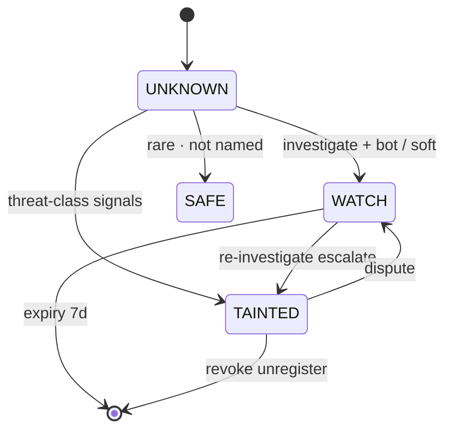

### Shield decision

| Memory | Decision |
|---|---|
| TAINTED | BLOCK |
| WATCH | WARN |
| SAFE | ALLOW |
| none | ESCALATE |

### ENS vs registry after dispute

```text
Dispute → ENS saviours.status = WATCH
        → Registry row unchanged (append-only)
        → Shield may still BLOCK via registry until revoke story understood
Revoke  → ENS unregistered (miss)
        → Registry may still hold historical TAINTED
```

---

## 14. Deployments (source of truth)

Addresses live in `deployments/*.json` — **never invent**, never put contract addresses only in `.env`.

| Artifact | Role |
|---|---|
| `deployments/sepolia.json` | SavioursRegistry |
| `deployments/sepolia-ens-identity.json` | Parent, resolver, UserRegistry |
| `evals/demo-targets.json` | Locked demo addresses |
| `evals/seed-incidents.json` | Govern seeds + `proof` badge |

---

## 15. Non-goals (architecture)

- Ambient monitoring / general detector
- Static chain payloads in product paths
- AI-owned verdicts
- Mainnet ENS enforcement in this cut (Sepolia ceiling is intentional)
- Treating Bazantic as the detector (it meters; Graph + ENS own truth)
