# SAVIOURS diagrams — Excalidraw import kit

Every diagram below is **Mermaid**. Use these to rebuild boards in Excalidraw.

## How to import into Excalidraw

### Option A — paste Mermaid (recommended)

1. Open [excalidraw.com](https://excalidraw.com) (or Excalidraw desktop / Obsidian plugin).
2. Menu → **More tools** → **Mermaid to Excalidraw** (or Insert → Mermaid).
3. Paste **one** `flowchart` block at a time (native editable elements).
4. Sequence / state diagrams import as images — fine for slides; prefer flowcharts for editable boards.

### Option B — `.mmd` files

Plain Mermaid sources live in [`diagrams/`](./diagrams/). Open a file, copy all, paste into Excalidraw Mermaid import.

### Option C — CLI (optional)

```bash
# if you use markdown-mermaid-to-excalidraw / me2ex-conv:
me2ex-conv -i docs/DIAGRAMS.md -o docs/diagrams/saviours
```

**Tip:** Excalidraw’s converter supports **flowcharts** best. This file prefers `flowchart` for that reason. Matching narrative lives in [ARCHITECTURE.md](./ARCHITECTURE.md).

---

## Index

| # | File | Title |
|---|---|---|
| 01 | [`01-product-loop.mmd`](./diagrams/01-product-loop.mmd) | Product loop |
| 02 | [`02-system-context.mmd`](./diagrams/02-system-context.mmd) | System context |
| 03 | [`03-trust-boundary.mmd`](./diagrams/03-trust-boundary.mmd) | Trust boundary |
| 04 | [`04-chain-split.mmd`](./diagrams/04-chain-split.mmd) | Chain split |
| 05 | [`05-user-walkthrough.mmd`](./diagrams/05-user-walkthrough.mmd) | User / demo walkthrough |
| 06 | [`06-investigate.mmd`](./diagrams/06-investigate.mmd) | Investigate → Remember |
| 07 | [`07-resolve.mmd`](./diagrams/07-resolve.mmd) | Resolve MEMORY HIT |
| 08 | [`08-agent-pay.mmd`](./diagrams/08-agent-pay.mmd) | Agent pay (who pays) |
| 09 | [`09-naming-ceremony.mmd`](./diagrams/09-naming-ceremony.mmd) | Naming ceremony |
| 10 | [`10-eac-roles.mmd`](./diagrams/10-eac-roles.mmd) | EAC roles |
| 11 | [`11-evidence-pipeline.mmd`](./diagrams/11-evidence-pipeline.mmd) | Evidence pipeline |
| 12 | [`12-signal-gate.mmd`](./diagrams/12-signal-gate.mmd) | Signal gate |
| 13 | [`13-memory-honesty.mmd`](./diagrams/13-memory-honesty.mmd) | Memory honesty |
| 14 | [`14-write-gate.mmd`](./diagrams/14-write-gate.mmd) | Write gate |
| 15 | [`15-monorepo.mmd`](./diagrams/15-monorepo.mmd) | Monorepo modules |
| 16 | [`16-surfaces.mmd`](./diagrams/16-surfaces.mmd) | Surfaces |

---

## 01 · Product loop

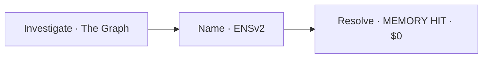

---

## 02 · System context

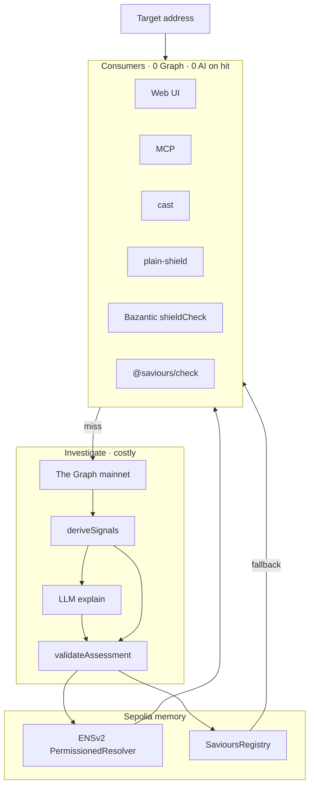

---

## 03 · Trust boundary

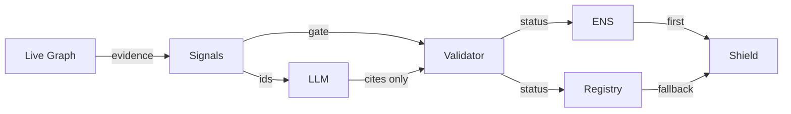

---

## 04 · Chain split

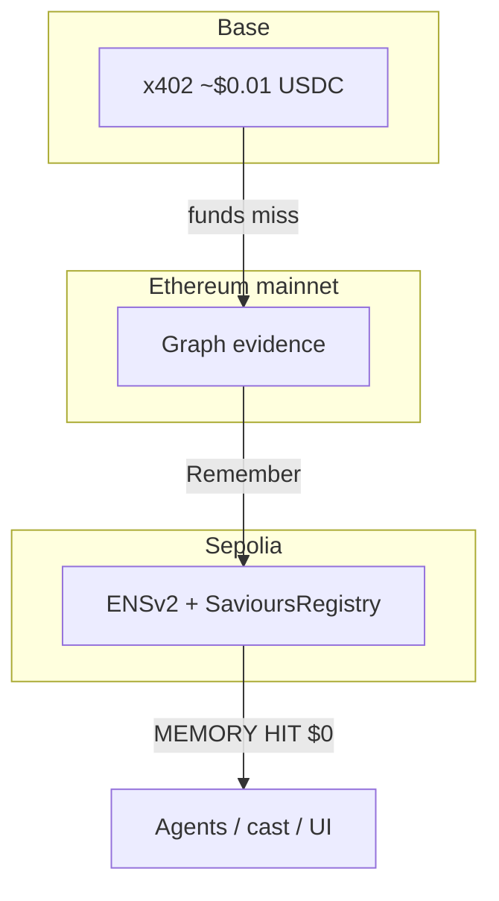

---

## 05 · User / demo walkthrough

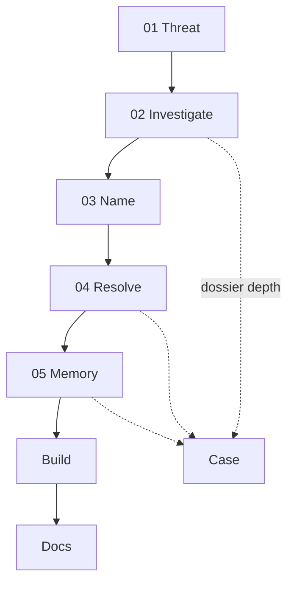

---

## 06 · Investigate → Remember

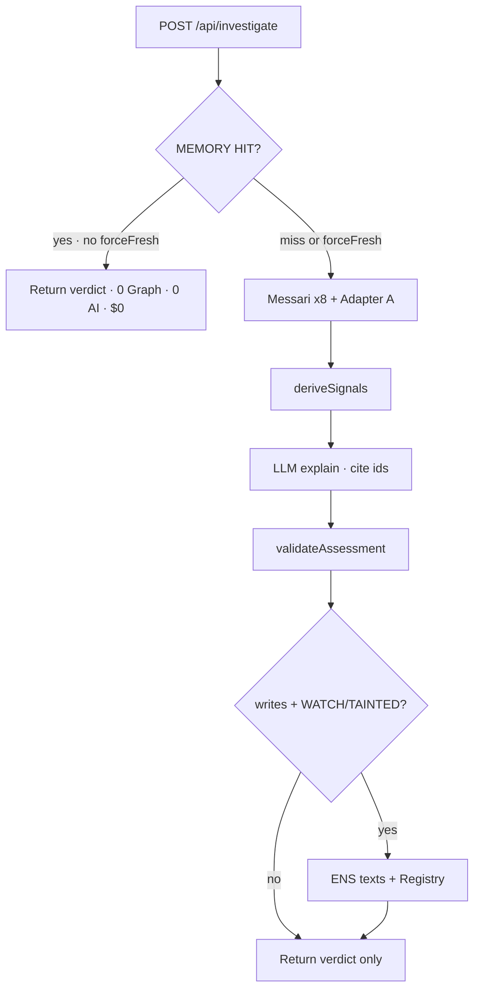

---

## 07 · Resolve MEMORY HIT

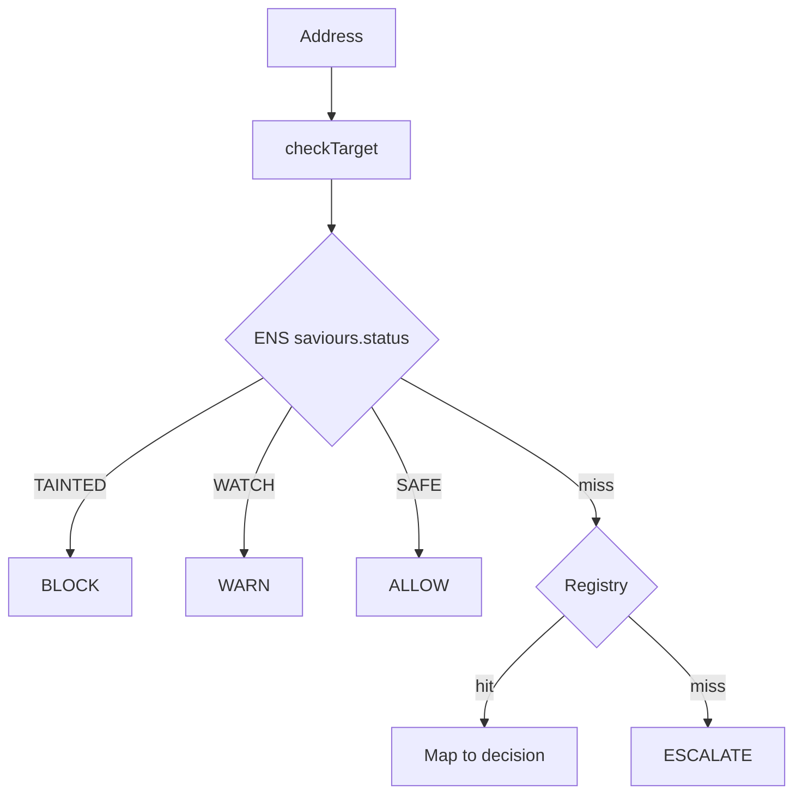

---

## 08 · Agent pay (who pays)

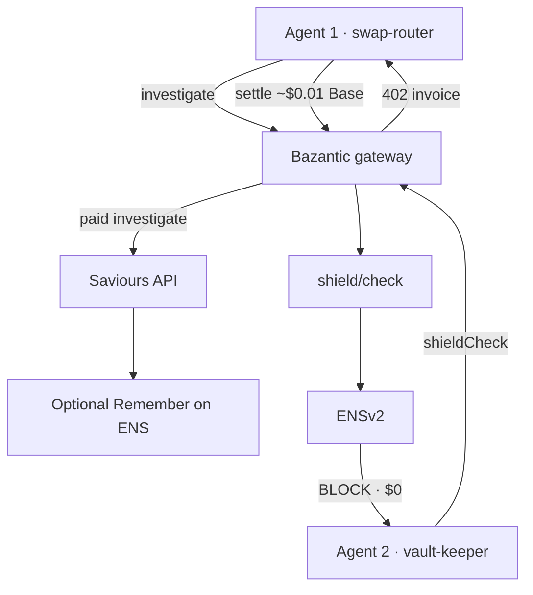

---

## 09 · Naming ceremony

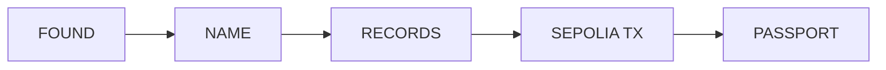

---

## 10 · EAC roles

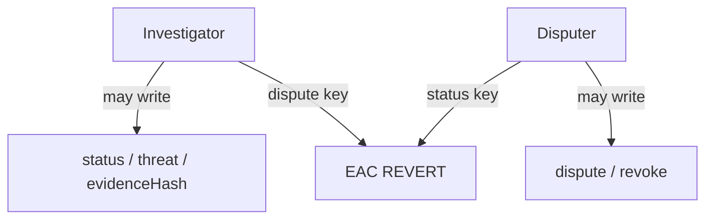

---

## 11 · Evidence pipeline

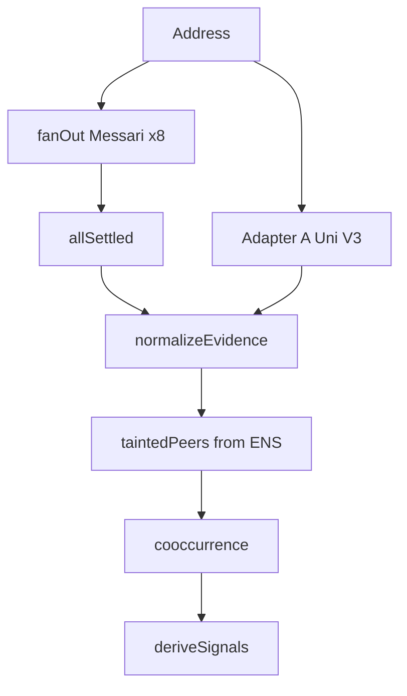

---

## 12 · Signal gate

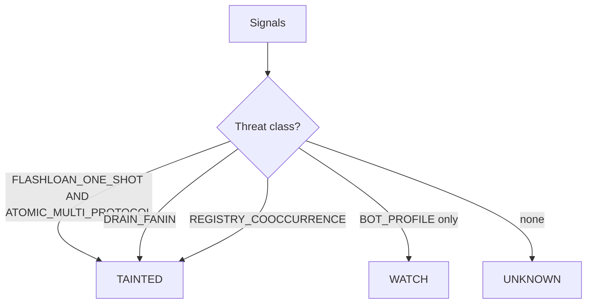

---

## 13 · Memory honesty

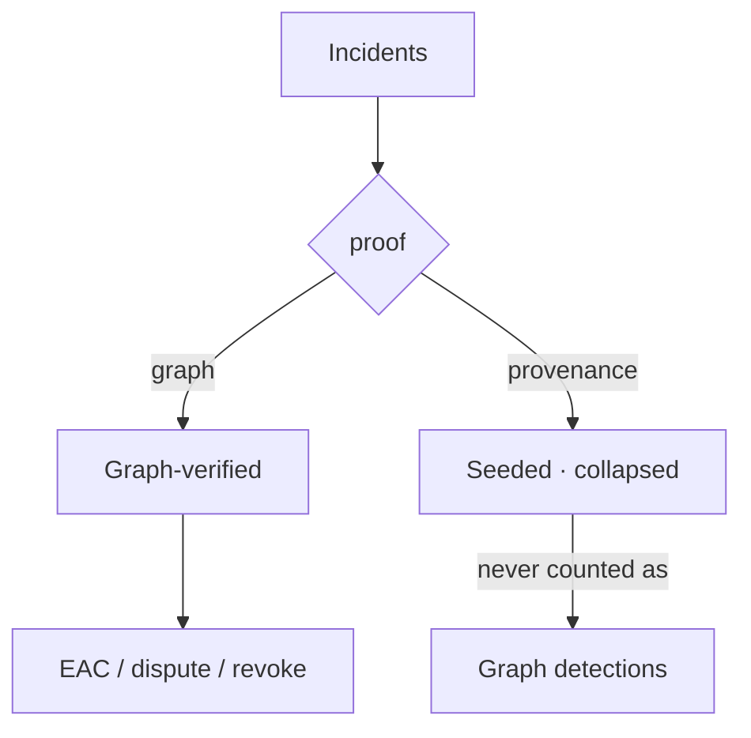

---

## 14 · Write gate

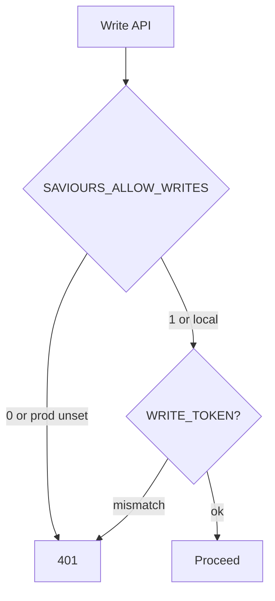

---

## 15 · Monorepo modules

```mermaid
flowchart TB
  web[apps/web] --> core[packages/core]
  mcp[packages/mcp] --> core
  check[packages/check] --> ens[ENSv2]
  core --> graph[The Graph]
  core --> ens
  core --> reg[SavioursRegistry]
  consumers[consumers/plain-shield] --> ens
  web --> baz[Bazantic]
```

---

## 16 · Surfaces

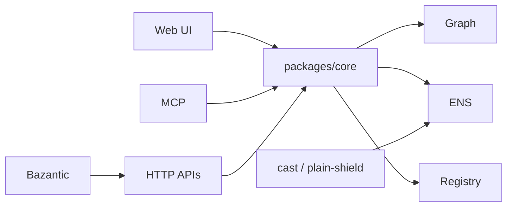

---

## Copy-paste checklist (film board)

Build one Excalidraw page in this order for judges:

1. Product loop (01)
2. User walkthrough (05)
3. Investigate (06) + Agent pay (08)
4. Naming (09) + EAC (10)
5. Resolve (07)
6. System context (02) as appendix
